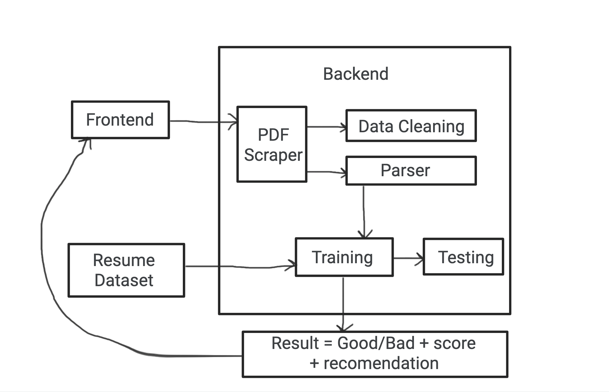

# Resume Analyzer

## What is the Resume Analyzer and What does it do?

Whether this is because of formatting, typos, lack of experience, or poor wording, it has been a consistent hinder for students to get internships. Therefore, we have decided to create an analyzer that takes in your resume and returns suggestions on how to make it better and more appealing to recruiters. 

Users can:
upload a PDF of their resume through the frontend interface
The backend extracts text data from the PDF, which is then cleaned and normalized
Users can then access parsed information
Users can access an analysis of the effectiveness of their resume based on criteria such as sectioning, keywords, and grammar.
Users receive an overall score based on the ML model’s evaluation criteria
Users will receive feedback on how to improve their resumes
More can be found here: https://docs.google.com/document/d/13XSAUw4IflXhnf2wsx3LNB3hBEl-5cFya2aIrLX-CeQ/edit?usp=sharing

## Technical Architecture:



## Group members and their role

- **Vikramaditya Pidaparthi:** Contributor to the backend, specifically creating the Spacy natural-language-processing model to train and test the dataset and use the data check to see if the uploaded resume is good or not, along with creating the score. 

- **Keisha Kaba:** Responsible for creating and developing functionality of the PDF parser, as well as writing the Naive Bayes model

- **Akriti Arora:** Initial contributions to PDF parser, and Frontend responsibility including integration with backend and updates corresponding to changes in the model.


## Technologies Used

- **Frontend:** Streamlit
- **Backend:** Pandas, NumPy, NLTK, spaCy
- **File Parsing:** PyPDF2

## Installation

1. Clone the repository:
   ```bash
   git clone https://github.com/CS222-UIUC-FA23/group-project-team69.git
   ```


2. Install dependencies:

   ```bash
   pip install PyPDF2
   pip install streamlit
   pip install pandas
   ```

3. Run the application:

   ```bash
   streamlit run streamlit.py
   ```

## Usage

1. Visit the deployed application or run it locally.
2. Upload a PDF resume using the provided interface.
3. Receive instant analysis results, including a numeric score.
4. Explore sample resumes for improvement.


